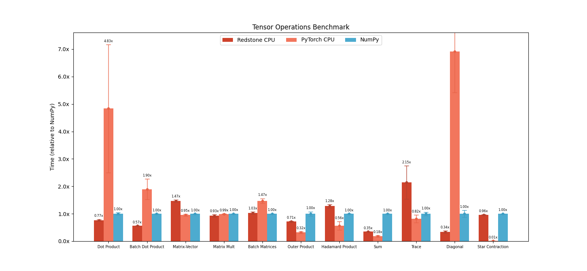

<div align="center">


[](https://github.com/BhavyeMathur/redstone-ml/actions/workflows/rust.yml)


**High-performance Tensor Computation and Machine Learning with Dynamic Auto-Differentiation natively in Rust**

<br/>
</div>

Modeled after PyTorch and NumPy, it provides the following features:

1. [N-dimensional Arrays](#n-dimensional-array-for-tensor-computations) (`NdArray`) for tensor computations.
2. [Linear Algebra & Operations](#linear-algebra-broadcasting-and-reductions) with GPU and CPU acceleration
3. [Dynamic Automatic Differentiation](#automatic-differentiation-with-redstone) (reverse-mode autograd) for machine learning.
 
To install either do `cargo install redstone-ml` or add this library to `Cargo.toml`.

Internally, Redstone speeds up its operations using custom ARM NEON kernels, BLAS, and vDSP on supported architectures. This makes it blazing fast! The benchmark below is for single-threaded Apple Silicon.



This project is still in its early stage, so feature requests, bugs, and other contributions are very welcome. Please contact me if you are interested!

# Documentation

More detailed documentation is available [here]().

# N-dimensional Array for Tensor Computations

An `NdArray` is a fixed-size multidimensional array container defined by its `shape`
and datatype. 1D (vectors) and 2D (matrices) arrays are often of special interest
and can be used in various linear algebra computations
including dot products, matrix products, batch matrix multiplications, einsums, and more.

`NdArrays` can be iterated over (along configurable dimensions), reshaped, sliced, and indexed,
reduced, and more.

This struct is heavily modeled after NumPy's `ndarray` and supports many of the same methods.

Example:

```rust
use redstone_ml::*;

let matrix_a = NdArray::new([[1, 3, 2], [-1, 0, -1]]); // shape [2, 3]
let matrix_b = NdArray::randint([3, 7], -5, 3);

let matrix_view = matrix_b.slice_along(Axis(1), 0..2); // shape [3, 2]
let matrix_c = matrix_a.matmul(matrix_view);

let result = matrix_c.sum();
```

## NdArray Views & Lifetimes

There are 2 ways we can create NdArray views: by borrowing or by consuming:
```rust
let data = NdArray::<f64>::rand([9]);
let matrix = (&data).reshape([3, 3]); // by borrowing (data remains alive after)

let data = NdArray::<f64>::rand([9]);
let matrix = data.reshape([3, 3]); // by consuming data
```

The consuming syntax allows us to chain operations without worrying about lifetimes
```rust
// a reshaped and transposed random matrix
let matrix = NdArray::<f64>::rand([9]).reshape([3, 3]).T();
```

Operations like `reshape`, `view`, `diagonal`, `squeeze`, `unsqueeze`, `T`, `transpose`, and
`ravel` do not create new NdArrays by duplicating memory (which would be slow).
They always return `NdArray` views which share memory with the source `NdArray`.
`NdArray::clone()` or `NdArray::flatten()` can be used to duplicate the underlying `NdArray`.

This means that all `NdArray` views have a lifetime at-most as long as the source `NdArray`.

## Linear Algebra, Broadcasting, and Reductions

We currently support the core linear algebra operations including dot products,
matrix-vector and matrix-matrix multiplications, batched matrix multiplications, and trace.

```rust
vector1.dot(vector2);

matrix.trace(); // also trace_along/offset_trace
matrix.diagonal(); // also diagonal_along/offset_diagonal
matrix.matmul(vector);
matrix1.matmul(matrix2);

batch_matrices1.bmm(batch_matrices2);

// generic einsums
einsum([&matrix1, &matrix2, &vector], (["ij", "kj", "i"], "ik"));
```

We can also perform various reductions including `sum`, `product`, `min`, `max`,
`min_magnitude`, and `max_magnitude`. Each of these is accelerated with various libraries
including vDSP, Arm64 NEON SIMD, and BLAS.

```rust
let sum = ndarray.sum();
let sum_along = ndarray.sum_along([0, -1]); // sum along first and last axes
```

`NdArrays` can be used in arithmetic operations using the usual binary operators including
addition (`+`), subtraction (`-`), multiplication (`*`), division (`/`), remainder (`%`),
and bitwise operations (`&`, `|`, `<<`, `>>`).

```rust
let result = &arr1 + &arr2; // non-consuming
let result = &arr1 + arr2;  // consumes RHS
let result = arr1 + arr2;   // consumes both
```

`NdArrays` are automatically broadcast using the exact same rules as NumPy
to perform efficient computations with different-dimensional (yet compatible) data.

## Slicing, Indexing, and Iterating

Slicing and indexing an `NdArray` always return a view. This is how we can access various
elements of vectors, columns/rows of matrices, and more.

```rust
let arr = NdArray::<f32>::rand([2, 4, 3, 5]); // 4D NdArray
let slice1 = arr.slice(s![.., 0, ..=2]);      // use s! to specify a slice
let slice2 = arr.slice_along(Axis(-2), 0);    // 0th element along second-to-last axis
let el = arr[[0, 3, 2, 4]];
```

One can also iterate over an `NdArray` in various ways:
```rust
for subarray in arr.iter() { /* 4x3x5 subarrays */ }
for subarray in arr.iter_along(Axis(2)) { /* 2x4x5 subarrays */ }
for el in arr.flatiter() { /* element-wise iteration */ }
```

## Automatic Differentiation with Redstone

The `Tensor` API is nearly identical to `NdArray` with the following differences:
1. Only floating point (`f32`, `f64`) types are supported
2. Operations without autograd implemented are omitted

`Tensors` allow us to perform dynamic automatic differentiation which is independent of control flow. This allows us to find matrix derivatives in complicated scenarios:

```rust
fn main() {
    let mut a = Tensor::new([[7.5, 12.0], [5.0, 6.25]]);
    let mut b = Tensor::new([0.5, -2.0]);
    let c = Tensor::scalar(10.0);
    
    a.set_requires_grad(true); 
    b.set_requires_grad(true);
    
    let matrix_2x2 = (&a / &b) * (c + 5.0);
    let result = matrix_2x2.matmul(&b);
    result.backward();

    println!("{:?}", a.gradient().unwrap());
    println!("{:?}", b.gradient().unwrap());
}
```

Gradients are only computed for `Tensors` with `requires_grad = true` to avoid unnecessary computation.
