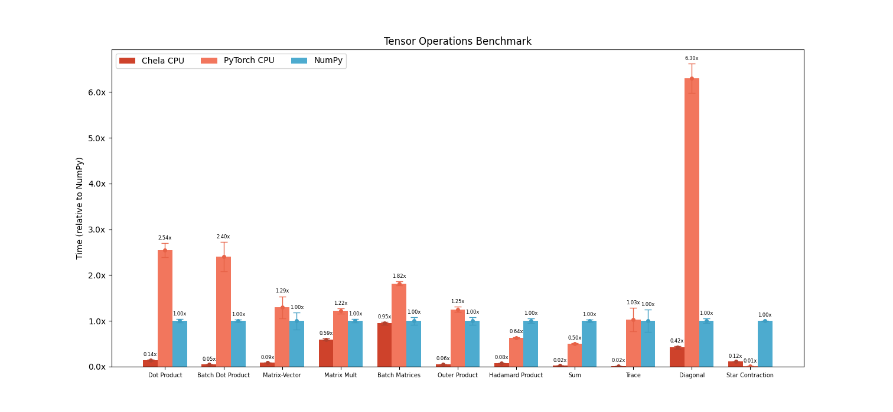

# Chela

Chela is a crate built for Tensor Computations, Linear Algebra, and Machine Learning natively in Rust. Modeled after PyTorch and NumPy, it provides the following features:

1. N-dimensional arrays (`NdArray`) for tensor computations.
2. CPU-accelerated linear algebra routines.
3. Reverse-mode automatic differentiation (autograd) for machine learning.

See [crates.io](https://crates.io/crates/chela) for installation details.

This project is still in its early stage, so feature requests, bugs, and other contributions are very welcome. Please contact me if you need help using Chela!

## Tensor Computations with Chela

We can easily define multidimensional arrays and operate on them as follows:

```rust
use chela::*;

fn main() {
    let matrix = NdArray::new([[7, 12, 3], [5, 6, 4], [0, 0, 1]]);
    let vector = NdArray::new(vec![5, 10, -5]);
    
    let result = matrix.matmul(vector);
    println!("{result:?}");
}
```
Use `NdArray::scalar`, `NdArray::ones/zeros`, `NdArray::arange` or `NdArray::linspace` to construct different kinds of ndarrays. We can add, subtract, multiply, and divide `NdArrays` using the usual operators. Chela automatically broadcasts tensor operations like NumPy and PyTorch too.

With `NdArray::slice` or `NdArray::slice_along`, we can index into these multidimensional arrays.

```rust
fn main() {
    // random 5x5 matrix with zeros along diagonal
    let mut matrix = NdArray::rand([5, 5]);
    matrix.diagonal().zero();
    
    let vector = NdArray::linspace(-5.0, 7.5, 5);

    // can also do matrix.slice_along(Axis(0), 2)
    let mut result = matrix.slice([2]).dot(vector);
    result *= 2.0;
}
```

Internally, Chela speeds up its operations using custom ARM NEON kernels, BLAS, and vDSP on supported architectures. This makes it blazing fast! The benchmark below is for Apple Silicon.



## Automatic Differentiation with Chela

Chela provides a wrapper around `NdArray` called `Tensor` (only for floating point types) that supports reverse-mode automatic differentiation for a subset of functions.

```rust
fn main() {
    let mut a = Tensor::new([[7.5, 12.0], [5.0, 6.25]]);
    let b = Tensor::new([[0.5, -2.0]]);
    let c = Tensor::scalar(10.0);

    // we wish to compute the gradient for a and b
    a.set_requires_grad(true); 
    b.set_requires_grad(true);

    let result = (&a / &b) * (c + 5.0);
    result.backward();

    println!("{:?}", a.gradient().unwrap());
    println!("{:?}", b.gradient().unwrap());
}
```
